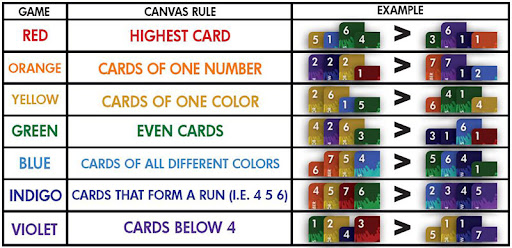
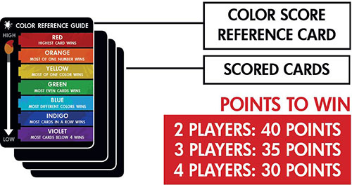

# card-game-python

## Welcome to my version of Red 7
Red 7 is a pretty obscure board game that no one knows about.
It involves using a combination of color and number on each card to determine whose card is more dominant.
The colors also determains the rules of the game.
Some strategies can be applied to the game to change the rules so that you can make yourself win a round.

## Components
- 49 cards, 1-7 \* 7 colors.
- *Canvas*, which holds the card that determines the rule 1[info](#footnote).
- Players:
  - A hand of cards
    - The cards here are kept secret
  - A palette of cards, from which the winning carsd are picked from.
    - The cards in here are visible to everyone
  - Points tracked for each player. Defines the game's termination.

## Card comparisions
Always compare numbers first before colors.
In the case that the numbers are the same, compare colors based on the spectrum from red to violet.
E.G.: A **ORANGE 7** is higher than a **RED 6**, but a **RED 6** is higher than an **ORANGE 6**.

## Gameplay
### Start:
- Each player is dealt with a hand of 7 cards
- Each player is dealt with a palette of 1 card
- The *Canvas* will be initiated with RED - highest card
- The players will be orders according to their card in their palette. 
  The one with the lowest numbered card goes first, so that they have a chance of winning round 0.

### Turn:
A player has several options:
- Play a card to the palette
- Play a card to the *Canvas* to change the rule
  - You must win the new game after you do this. (Doing this won't make you lose)
- Play a card to the *Canvas*, **then**, play to the palette
  - If you cannot play to the canvas due to the reason above, you can only play to the palette
- Do nothing and lose this turn. Pretty much useless in this version other than skipping a turn.  
A Turn is finished when every player has gone once.  

### End of a Turn:
- A winning player will be selected based on their palette and the current rule.  
- **Only** the winning player will score points. The number value on their winning cards will
  be added as points.  
- The winning cards will be removed from the winning player and shuffled back to the deck.
- Everyone's hand will be replenished to 7 cards.

### End of the game:
- Based on how many players there are, a threashold of points will be selected 2[info](#footnote).
- Once a player reaches the target points, the game immediately ends.
- The placements of the players are determined by their points.

#### footnote
1 -   
2 - 
